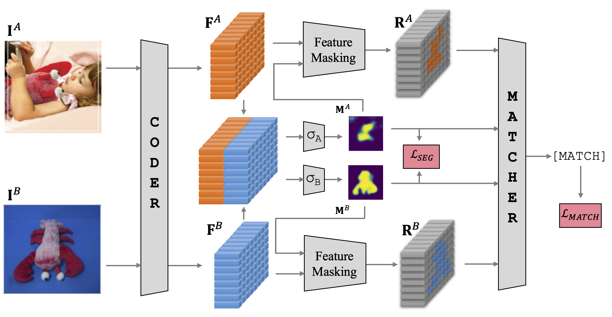

# SCOTT

This package contains reference to TIC dataset from the [Unstructured Object Matching using Co-Salient Region Segmentation](https://openaccess.thecvf.com/content/CVPR2022W/IMW/papers/Stoian_Unstructured_Object_Matching_Using_Co-Salient_Region_Segmentation_CVPRW_2022_paper.pdf)  paper published at the Image Matching Workshop hosted at CVPR 2022 from  New Orleans, USA.



The data should be used under research purposes only.

Download link: !Check soon!

If you use to use our data for your research, please cite the following paper:
```
@InProceedings{Stoian_2022_CVPR,
    author    = {Stoian, Ioana-Sabina and Sandu, Ionut-Catalin and Voinea, Daniel and Popa, Alin-Ionut},
    title     = {Unstructured Object Matching Using Co-Salient Region Segmentation},
    booktitle = {Proceedings of the IEEE/CVF Conference on Computer Vision and Pattern Recognition (CVPR) Workshops},
    month     = {June},
    year      = {2022},
    pages     = {5051-5060}
}

```


